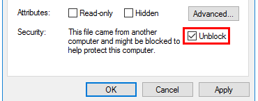
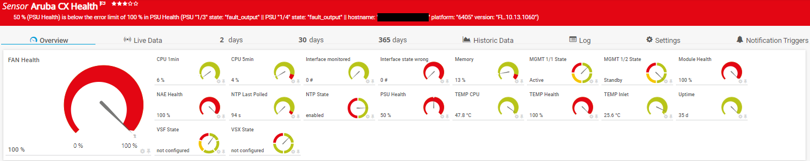
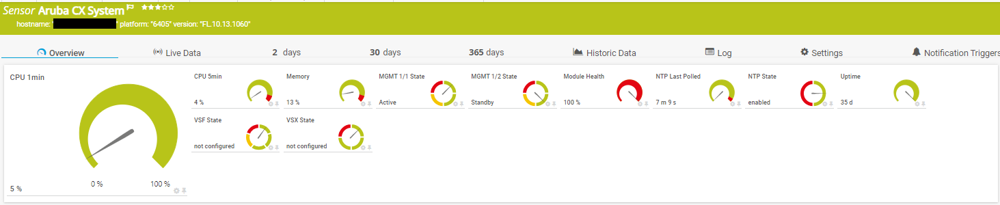
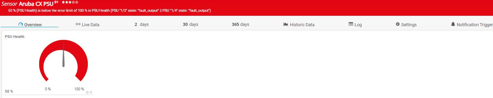
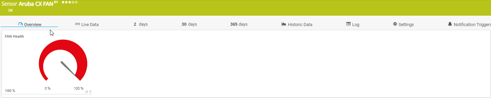
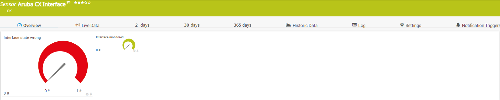

# PRTG-ArubaCX

<!-- ABOUT THE PROJECT -->
### About The Project
Project Owner: Jannos-443

Monitors Aruba CX Switches using the Switch Rest API

Powershell Script to monitor Aruba CX Switch Health including CPU, FAN, PSU...

Free and open source: [MIT License](https://github.com/Jannos-443/PRTG-ArubaCX/blob/main/LICENSE)

**Features**
* Aruba CX System
  * CPU Load
  * Memorie Load
  * MGMT State
  * NTP State
  * Uptime
  * VSF State
  * VSX State
  * Module Health
* Aruba CX Temperature
  * TEMP Health
  * Inlet Temp
  * CPU Temp
* Aruba CX PowerSupply Health
* Aruba CX FAN Health
* Aruba CX NAE Health
* Aruba CX Interface Status
  * Interface status
  * filter for interface description (regular expression)
     * ExcludeDescription
     * IncludeDescription
  * filter for interface name (regular expression)
     * ExcludeInterface
     * IncludeInterface
  * set DesiredState to up or down

<!-- GETTING STARTED -->
## Getting Started

1. Make sure the VMware PowerArubaCX Module exists on the Probe under the Powershell Module Path `C:\Program Files (x86)\WindowsPowerShell\Modules\PowerArubaCX`
   - `Install-Module PowerArubaCX`
   - https://github.com/PowerAruba/PowerArubaCX

2. Set Powershell Execution Policy to Unrestricted
    - On the PRTG Server open a Powershell (x86) prompt as admin and run
	- `Set-ExecutionPolicy Unrestricted`
	- Note:  This MUST be done in the (x86) version of powershell

3. Place `PRTG-ArubaCX.ps1` under `C:\Program Files (x86)\PRTG Network Monitor\Custom Sensors\EXEXML`

4. check if file needs to be unblocked
    - PWSH: `Unblock-File C:\Scripts\Script.ps1` 
    - GUI: right click -> properties -> unblock
    
      

5. Copy all `.ovl` files to `C:\Program Files (x86)\PRTG Network Monitor\lookups\custom`

6. In PRTG go to Setup > Administrative tools:
	- Reload lookups

7. Create new Sensor

   | Settings | Value |
   | --- | --- |
   | EXE/Script Advanced | PRTG-ArubaCX.ps1 |
   | Parameters | -Hostname "%host" -Username "%linuxuser" -Password "%linuxpassword" |
   | Scanning Interval | 10 minutes |


8. Change parameter if needed 
   - Include/Exclude
   - Change Limits

## Usage

Default (show all channels)
```powershell
-Hostname "%host" -Username "%linuxuser" -Password "%linuxpassword"
```

<br>

Show only System Channels
```powershell
-Hostname "%host" -Username "%linuxuser" -Password "%linuxpassword" -ChannelSystem
```

<br>

Show only PSU Channels
```powershell
-Hostname "%host" -Username "%linuxuser" -Password "%linuxpassword" -ChannelPSU
```

<br>

Show only FAN Channels
```powershell
-Hostname "%host" -Username "%linuxuser" -Password "%linuxpassword" -ChannelFAN
```

<br>

Show only NAE Channels
```powershell
-Hostname "%host" -Username "%linuxuser" -Password "%linuxpassword" -ChannelNAE
```

<br>

Show only Interface Channels 
- (Default = only Interfaces with the word "uplink" in the desciption)

```powershell
-Hostname "%host" -Username "%linuxuser" -Password "%linuxpassword" -ChannelInterface
```

Include only Interfaces with the word "test123" in the description
```powershell
-Hostname "%host" -Username "%linuxuser" -Password "%linuxpassword" -ChannelInterface -IncludeDescription "^(.*test123.*)$" 
```

Exclude Interfaces with the word "testexclude" in the description
```powershell
-Hostname "%host" -Username "%linuxuser" -Password "%linuxpassword" -ChannelInterface -IncludeDescription "^(.*testexclude.*)$"
```

Exclude Interfaces with the word "testexclude" in the description AND also alert for "AdminDown" interfaces
```powershell
-Hostname "%host" -Username "%linuxuser" -Password "%linuxpassword" -ChannelInterface -IncludeDescription "^(.*testexclude.*)$" -IncludeAdminDown
```

Exclude Interfaces with the word "testexclude" in the description
```powershell
-Hostname "%host" -Username "%linuxuser" -Password "%linuxpassword" -ChannelInterface -ExcludeDescription "^(.*testexclude.*)$"
```

Include Interfaces with the the Interface Name 1/1/48
```powershell
-Hostname "%host" -Username "%linuxuser" -Password "%linuxpassword" -ChannelInterface -IncludeInterface "^(1\/1\/48)$"
```


<br>


## Includes/Excludes

You can use the variables to exclude/include things.  
The variables take a regular expression as input to provide maximum flexibility.

For more information about regular expressions in PowerShell, visit [Microsoft Docs](https://docs.microsoft.com/en-us/powershell/module/microsoft.powershell.core/about/about_regular_expressions).

".+" is one or more charakters
".*" is zero or more charakters